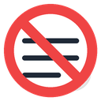
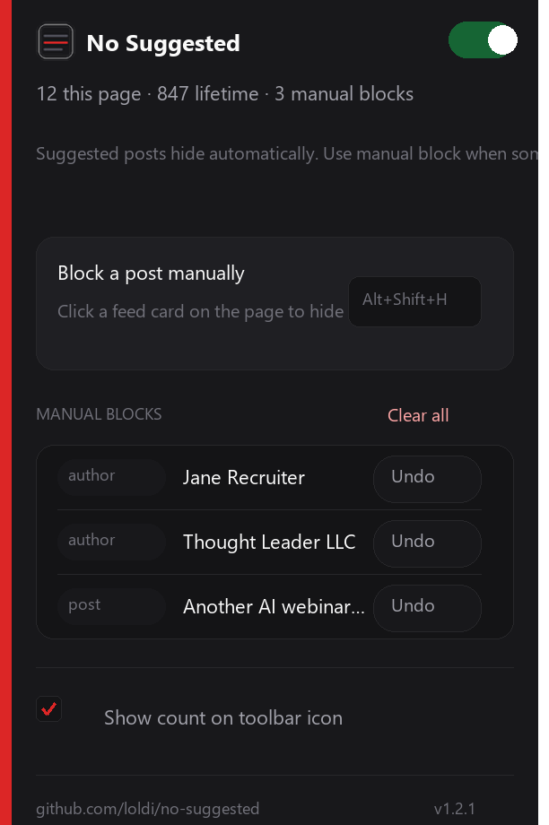

# No Suggested

---

<em>Suggested posts hide themselves. You handle the rest.</em>

[Install](#install) · [Popup](#the-popup) · [Features](#feature-matrix) · [Manual block](#manual-block-picker) · [How it works](#how-it-works)

---

A tiny browser extension that hides LinkedIn **Suggested** posts from your feed. No accounts, no telemetry, no dependencies.

**What you get**

- Auto-hides every feed card labeled **Suggested**
- **Manual block** picker (`Alt+Shift+H`) for anything else that slips through. Blocked by author when possible, so future posts from that account disappear too.
- Toolbar **popup**: on/off switch, live stats, manual block list with one-click undo
- Optional **badge counter** on the toolbar icon (toggle in the popup)

## Feature matrix

### Hiding

| Capability | Status |
|---|---|
| Auto-hide "Suggested" feed cards | ✅ |
| Manual block picker | ✅ |
| Block by author (future posts from same account) | ✅ |
| Persists across browser restarts | ✅ |

### Popup / settings

| Capability | Status |
|---|---|
| Master on/off toggle | ✅ |
| "Show count on toolbar icon" toggle | ✅ |
| Live stats: this page / lifetime / manual blocks | ✅ |
| Manual block list with undo | ✅ |
| Clear all manual blocks | ✅ |

### Planned features

| Feature | Notes |
|---|---|
| Hide "Promoted" / sponsored posts | Same approach as Suggested |
| Self-like post removal | Hide posts where the author liked their own content |
| Export / import manual block list | Backup or move to another machine |
| Keyword muting ("thrilled to announce" etc.) | User-defined word filters in the popup |
| Officially distributed Chrome/Firefox builds | Install from a store, no unpacked loading |
| Cloud sync of block list | Same blocks across signed-in browsers |

## Supported browsers

| Browser | Status | Install method |
|---|---|---|
|  | ✅ Supported | Temporary add-on via `about:debugging` |
|  | ✅ Supported | Unpacked via `chrome://extensions` |
|  | ✅ Should work | Unpacked via `edge://extensions` (Chromium) |
|  | ✅ Should work | Unpacked via `brave://extensions` (Chromium) |
|  | ⚠️ Untested | Unpacked via `opera://extensions` (Chromium) |
|  | ❌ Not supported | Would require Xcode conversion |

## Install

Grab the latest zip from [Releases](https://github.com/loldi/no-suggested/releases/latest), unzip, then:

### Firefox

1. Open `about:debugging#/runtime/this-firefox`
2. Click **Load Temporary Add-on…**
3. Choose `manifest.json` in the unzipped folder

> Temporary add-ons disappear when Firefox restarts. Reload the same way after a restart. Your manual block list stays saved in the browser.

### Chrome / Edge / Brave

1. Open `chrome://extensions` (or `edge://extensions` / `brave://extensions`)
2. Enable **Developer mode**
3. Click **Load unpacked**
4. Select the unzipped folder

## The popup

Click the toolbar icon:

- **On/off toggle** — turns filtering off (hidden posts reappear immediately)
- **Inline stats** — `this page` / `lifetime` / `manual blocks`
- **Block a post manually** — starts the picker (`Alt+Shift+H`)
- **Manual blocks** list — undo any block individually, or clear all
- **Show count on toolbar icon** — optional badge with the current page count

## Manual block picker

When a non-Suggested post slips through:

1. Press `Alt+Shift+H`, or click **Block a post manually** in the popup
2. Cursor becomes a crosshair; a toast appears top-right
3. Hover a post for a red outline
4. Click to block it permanently
5. `ESC` to cancel

Blocks are saved locally in your browser. When possible, the extension remembers the **author** so their future posts stay hidden too.

## How it works

LinkedIn renames CSS classes constantly, but the word **Suggested** on a feed card is stable. The extension watches the feed, marks matching cards as hidden, and keeps working as you scroll. Manual blocks are stored locally and re-applied every time you visit LinkedIn.

## License

MIT — do whatever you want with it.
